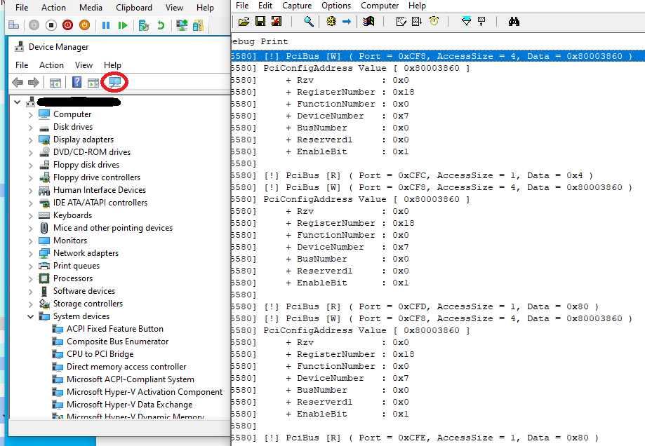

# VmwpMonitor


A vital piece of any fuzzer is the monitoring/logging, during fuzzing we use it to monitor the behavior of target program and detect interesting behaviors corresponding to the current input data.

The `VmwpMonitor` is a DLL that you must inject it to the `vmwp.exe` process to monitor the `IO` operations on the Emulated Devices between the Guest Vms and the vm worker process, there are number of emulated devices
on the Hyper-V that are using on the `Generation 1` VMs, the following table consist of Modules that contain/provide the emulated devices.

For more information about vmwp (VM Worker Process) and emulated devices refer to these links:

- [Attacking the VM Worker Process](https://msrc-blog.microsoft.com/2019/09/11/attacking-the-vm-worker-process/)
- [Hyntrospect: a fuzzer for Hyper-V devices](https://www.sstic.org/2021/presentation/hyntrospect_a_fuzzer_for_hyper-v_devices/)

| DLLs                  | Responsibility                                          | Devices/Logics in scope                                                                                                            |
| --------------------- | ------------------------------------------------------- | ---------------------------------------------------------------------------------------------------------------------------------- |
| VmEmulatedDevices.dll | Emulates many devices above 1250 and 1500 functions     | PitDevice PicDevice PciBusDevice SpeakerDevice IsaBusDevice Ps2Keyboard I8042Device VideoS3Device VideoDevice  DmaControllerDevice |
| vmuidevices.dll       | Emulates many devices, over                             | VideoDevice VideoDirt InputManager SynthMouseDevice SynthKeyboardDevice HidDevice SynthRdpServerConnection VideoSynthDevice        |
| vmEmulatedNic.dll     | Network card devices                                    | Class EthernetDevice, emulates the following cards: DEC 21041, DEC 21140A, DEC 21143                                               |
| VmEmulatedStorage.dll | Storage devices                                         | IdeControllerDevice IdeOpticalDrive IdeHardDrive IdeChannel DiskMetricDevice FloppyDrive                                           |
| winHvEmulation.dll    | x86 instructions emulation at UM (EmulatorVP functions) | N/A                                                                                                                                |
| Vmchipset.dll         | Emulates many chipsets                                  | IoApicEmulator PowerManagementEmulator                                                                                             |

---


> :bell:The `VmwpMonitor` is part of a fuzzer that I'm working on it, maybe in the future I'll publish the entire solution.
> 
>  **At the time this repo only contains the code for `VmEmulatedDevices.dll` module, you can add other modules in same way (just more effort!).**


---

As you know the `vmwp` implemented in C++, so for hooking you have to deal with class members! not really :-), you only need the `Prototype` of target function and it's relative offset is the module.

```bat
#:.
│   readme.md
│   VmwpMonitor.vcxproj
│   VmwpMonitor.vcxproj.user
│
├───.images
│       scan_hardware_change.png
│
└───src
    │   Debug.c
    │   Debug.h
    │   dllmain.c
    │   EmulatedDeviceDefines.h
    │   framework.h
    │   pch.c
    │   pch.h
    │
    ├───HookUtils
    │       Hook.c
    │       Hook.h
    │
    └───VmEmulatedDevices
        │   VmEmulatedDevices.h
        │
        ├───DmaControllerDevice
        │       DmaControllerDevice.c
        │       DmaControllerDevice.h
        │
        ├───I8042Device
        │       I8042Device.c
        │       I8042Device.h
        │
        ├───IsaBusDevice
        │       IsaBusDevice.c
        │       IsaBusDevice.h
        │
        ├───PciBusDevice
        │       PciBusDevice.c
        │       PciBusDevice.h
        │
        ├───PicDevice
        │       PicDevice.c
        │       PicDevice.h
        │
        ├───PitDevice
        │       PitDevice.c
        │       PitDevice.h
        │
        └───VideoS3Device
                VideoS3Device.c
                VideoS3Device.h
```


In the source tree for every device supported by the `VmEmulatedDevices.dll` there is a corresponding pare of files (header and source) with the same name, and in the files there is a function called `Init` + DeviceName + `Hooks` (e.x, for `PciBusDevice` it's `InitPciBusDeviceHooks`).

This function has two variables that must fill with the **RVA offset** of target functions in desire DLL module, you can achieve these offsets by Static analysis or Dynamically by a Debugger. It's just a simple operation `FunctionAddress` - `BaseAddress`.


<details>
<summary>Click to see the InitPciBusDeviceHooks</summary>

```c
BOOL
InitPciBusDeviceHooks(_Inout_ VM_EMULATED_DEVICES_HOOK_ENTRY * pEntry)
{
    if (pEntry == NULL)
        return FALSE;

    HMODULE hVmEmulatedDevices = GetModuleHandle(_T("VmEmulatedDevices"));
    if (hVmEmulatedDevices == NULL)
        return FALSE;

    dbgPrint(_T("[!] Base address of VmEmulatedDevices.dll module  0x%" _T(PRIX64) L" .\n"),
             hVmEmulatedDevices);

    //
    // RVA Offset of target functions,
    // Notice that these offsets can change on diffrent versions of target module
    //
    // RVA Offset = FunctionAddress - BaseAddress
    //

    ULONG64 NotifyIoPortReadRvaOffset   = 0x175a0;
    ULONG64 NotifyIoPortRWriteRvaOffset = 0x175e0;

    pEntry->DevceType            = EmulatedDeviceTypePciBusDevice;
    pEntry->NotifyIoPortReadOrig = GET_FUNCTION_BY_OFFSET(PfnNotifyIoPortRead,        // Function Prototype
                                                          hVmEmulatedDevices,         // Module Base address
                                                          NotifyIoPortReadRvaOffset); // Function RVA Offset

    pEntry->NotifyIoPortWriteOrig = GET_FUNCTION_BY_OFFSET(PfnNotifyIoPortWrite,         // Function Prototype
                                                           hVmEmulatedDevices,           // Module Base address
                                                           NotifyIoPortRWriteRvaOffset); // Function RVA Offset

    //
    // Validate function pointer/address
    //
    if (pEntry->NotifyIoPortReadOrig == NULL || pEntry->NotifyIoPortWriteOrig == NULL)
        return FALSE;

    pEntry->NotifyIoPortWriteHooked = &PciBusDeviceNotifyIoPortWriteHooked;
    pEntry->NotifyIoPortReadHooked  = &PciBusDeviceNotifyIoPortReadHooked;

    return TRUE;
}
```
</details>

---

Use this script to retrieve the RVA offsets of target functions in the Windbg.

```c
1: kd> !process 0 0 vmwp.exe
PROCESS ffff9f84f0470080
    SessionId: 0  Cid: 0c28    Peb: 216966b000  ParentCid: 1348
    DirBase: 1d307a002  ObjectTable: ffffcc0b96f7e480  HandleCount: 712.
    Image: vmwp.exe


.process /i ffff9f84f0470080; g; .reload


// run lmDvmvmemulateddevices to get base address of vmemulateddevices.dll

r $t1=00007fff`f50d0000


.printf "ULONG64 NotifyIoPortReadRvaOffset = 0x%X \n"   , (@@masm(vmemulateddevices!PciBusDevice::NotifyIoPortRead - $t1))
.printf "ULONG64 NotifyIoPortRWriteRvaOffset = 0x%X \n" , (@@masm(vmemulateddevices!PciBusDevice::NotifyIoPortWrite - $t1))
.printf "ULONG64 NotifyIoPortReadRvaOffset = 0x%X \n"   , (@@masm(vmemulateddevices!I8042Device::NotifyIoPortRead - $t1))
.printf "ULONG64 NotifyIoPortRWriteRvaOffset = 0x%X \n" , (@@masm(vmemulateddevices!I8042Device::NotifyIoPortWrite - $t1))
.printf "ULONG64 NotifyIoPortReadRvaOffset = 0x%X \n"   , (@@masm(vmemulateddevices!IsaBusDevice::NotifyIoPortRead - $t1))
.printf "ULONG64 NotifyIoPortRWriteRvaOffset = 0x%X \n" , (@@masm(vmemulateddevices!IsaBusDevice::NotifyIoPortWrite - $t1))
.printf "ULONG64 NotifyIoPortReadRvaOffset = 0x%X \n"   , (@@masm(vmemulateddevices!PitDevice::NotifyIoPortRead - $t1))
.printf "ULONG64 NotifyIoPortRWriteRvaOffset = 0x%X \n" , (@@masm(vmemulateddevices!PitDevice::NotifyIoPortWrite - $t1))
.printf "ULONG64 NotifyIoPortReadRvaOffset = 0x%X \n"   , (@@masm(vmemulateddevices!PicDevice::NotifyIoPortRead - $t1))
.printf "ULONG64 NotifyIoPortRWriteRvaOffset = 0x%X \n" , (@@masm(vmemulateddevices!PicDevice::NotifyIoPortWrite - $t1))
.printf "ULONG64 NotifyIoPortReadRvaOffset = 0x%X \n"   , (@@masm(vmemulateddevices!VideoS3Device::NotifyIoPortRead - $t1))
.printf "ULONG64 NotifyIoPortRWriteRvaOffset = 0x%X \n" , (@@masm(vmemulateddevices!VideoS3Device::NotifyIoPortWrite - $t1))
.printf "ULONG64 NotifyIoPortReadRvaOffset = 0x%X \n"   , (@@masm(vmemulateddevices!DmaControllerDevice::NotifyIoPortRead - $t1))
.printf "ULONG64 NotifyIoPortRWriteRvaOffset = 0x%X \n" , (@@masm(vmemulateddevices!DmaControllerDevice::NotifyIoPortWrite - $t1))

```

```c
2: kd> .printf "ULONG64 NotifyIoPortReadRvaOffset = 0x%X \n"   , (@@masm(vmemulateddevices!PciBusDevice::NotifyIoPortRead - $t1))
ULONG64 NotifyIoPortReadRvaOffset = 0x175A0 
2: kd> .printf "ULONG64 NotifyIoPortRWriteRvaOffset = 0x%X \n" , (@@masm(vmemulateddevices!PciBusDevice::NotifyIoPortWrite - $t1))
ULONG64 NotifyIoPortRWriteRvaOffset = 0x175E0 
2: kd> .printf "ULONG64 NotifyIoPortReadRvaOffset = 0x%X \n"   , (@@masm(vmemulateddevices!I8042Device::NotifyIoPortRead - $t1))
ULONG64 NotifyIoPortReadRvaOffset = 0x1FBD0 
2: kd> .printf "ULONG64 NotifyIoPortRWriteRvaOffset = 0x%X \n" , (@@masm(vmemulateddevices!I8042Device::NotifyIoPortWrite - $t1))
ULONG64 NotifyIoPortRWriteRvaOffset = 0x1FF60 
2: kd> .printf "ULONG64 NotifyIoPortReadRvaOffset = 0x%X \n"   , (@@masm(vmemulateddevices!IsaBusDevice::NotifyIoPortRead - $t1))
ULONG64 NotifyIoPortReadRvaOffset = 0x14A70 
2: kd> .printf "ULONG64 NotifyIoPortRWriteRvaOffset = 0x%X \n" , (@@masm(vmemulateddevices!IsaBusDevice::NotifyIoPortWrite - $t1))
ULONG64 NotifyIoPortRWriteRvaOffset = 0x14A80 
2: kd> .printf "ULONG64 NotifyIoPortReadRvaOffset = 0x%X \n"   , (@@masm(vmemulateddevices!PitDevice::NotifyIoPortRead - $t1))
ULONG64 NotifyIoPortReadRvaOffset = 0x1CFF0 
2: kd> .printf "ULONG64 NotifyIoPortRWriteRvaOffset = 0x%X \n" , (@@masm(vmemulateddevices!PitDevice::NotifyIoPortWrite - $t1))
ULONG64 NotifyIoPortRWriteRvaOffset = 0x1D0A0 
2: kd> .printf "ULONG64 NotifyIoPortReadRvaOffset = 0x%X \n"   , (@@masm(vmemulateddevices!PicDevice::NotifyIoPortRead - $t1))
ULONG64 NotifyIoPortReadRvaOffset = 0x1A230 
2: kd> .printf "ULONG64 NotifyIoPortRWriteRvaOffset = 0x%X \n" , (@@masm(vmemulateddevices!PicDevice::NotifyIoPortWrite - $t1))
ULONG64 NotifyIoPortRWriteRvaOffset = 0x1A460 
2: kd> .printf "ULONG64 NotifyIoPortReadRvaOffset = 0x%X \n"   , (@@masm(vmemulateddevices!VideoS3Device::NotifyIoPortRead - $t1))
ULONG64 NotifyIoPortReadRvaOffset = 0x2B420 
2: kd> .printf "ULONG64 NotifyIoPortRWriteRvaOffset = 0x%X \n" , (@@masm(vmemulateddevices!VideoS3Device::NotifyIoPortWrite - $t1))
ULONG64 NotifyIoPortRWriteRvaOffset = 0x2B4B0 
2: kd> .printf "ULONG64 NotifyIoPortReadRvaOffset = 0x%X \n"   , (@@masm(vmemulateddevices!DmaControllerDevice::NotifyIoPortRead - $t1))
ULONG64 NotifyIoPortReadRvaOffset = 0x11910 
2: kd> .printf "ULONG64 NotifyIoPortRWriteRvaOffset = 0x%X \n" , (@@masm(vmemulateddevices!DmaControllerDevice::NotifyIoPortWrite - $t1))
ULONG64 NotifyIoPortRWriteRvaOffset = 0x11A30 
```


Every device has some interesting functions that could be useful for monitoring, in this project you can see the
`NotifyIoPortRead` and `NotifyIoPortWrite` functions which are corresponding to the x86 `IN` and `OUT` instructions in the Guest VM, whenever these instructions are called there is a callback (in vmwp) to `NotifyIoPortRead` or `NotifyIoPortWrite`. 
Thus by hooking theme we have an eye on these functions before/after their execution.

As mentioned before there are header/source files for each device, which contains the Hooks for target functions.
The hooked functions are simple, they only log the input parameters and finally call the original function (of course sometimes it's vice versa for instance the read operation).

In the hooked functions you have all you need, the data is simple yet expandable. Each value that read or write could have complex structure, you can find more information about it depend on the port number, for instance I put the structure for port number `0xCF8` ([CONFIG_ADDRESS](https://wiki.osdev.org/PCI#Configuration_Space_Access_Mechanism_.231)) in the `PciBusDevice` hooks, so it prints the expanded version of data that is written to the port. 


```c
//
// Only print the input values
//
LONG __fastcall PciBusDeviceNotifyIoPortReadHooked(
    _In_ PciBusDevice This,
    _In_ UINT16       IoPort,
    _In_ UINT16       AccessSize,
    _Inout_ UINT32 * pData)
{
    LONG Ret = PciBusDeviceHookEntry.NotifyIoPortReadOrig(This, IoPort, AccessSize, pData);

    dbgPrint(L"[!] PciBus [R] ( Port = 0x%hX, AccessSize = %d, Data = 0x%x )\n",
             IoPort,
             AccessSize,
             *pData);

    return Ret;
}

//
// Get more information about input values
//
LONG __fastcall PciBusDeviceNotifyIoPortWriteHooked(
    _In_ PciBusDevice This,
    _In_ UINT16       IoPort,
    _In_ UINT16       AccessSize,
    _In_ UINT32       Data)
{
    dbgPrint(L"[!] PciBus [W] ( Port = 0x%hX, AccessSize = %d, Data = 0x%x )\n",
             IoPort,
             AccessSize,
             Data);

    // PCI_CONFIG_ADDRESS
    if (IoPort == 0xCF8)
    {
        PCI_CONFIG_ADDRESS PciConfigAddress = {Data};
        PrintLogPciConfigAddress(PciConfigAddress);
    }

    return PciBusDeviceHookEntry.NotifyIoPortWriteOrig(This, IoPort, AccessSize, Data);
}

```


---

# Screenshot

Here is a screenshot from the output when using `Scan for hardware changes` in Device Manager of the Guest vm.





---

# Compile & Usage

The only dependency of project is the Microsoft Detours, which simply could be installed via VCPKG

```bat
vcpkg install detours:x64-windows detours:x86-windows
```


For injection you can use the [Process Hacker](https://processhacker.sourceforge.io/downloads.php), but first of all to using this DLL you must disable some of security mitigation's of `vmwp.exe` process, to do this you need a simple
kernel driver to change the process mitigation's on creation time (Using `PsSetCreateProcessNotifyRoutineEx`), thanks to [@R00tkitSMM](https://twitter.com/R00tkitSMM) you can simply grab the code from [here](https://github.com/meysamexploiter/utilities-/blob/master/vmwp_util.c) and use it.


> **Notice**: The code has a little bug, caused by setting all mitigation's to `NULL`, in case you have any problem with that
> change the code like this. Of course in such case you must enable `CFG` on the dll too (It's enabled by default).

```c
#pragma pack(push, 1)
typedef union _MitigationFlagsValues
{
    ULONG AsUlong;
    struct
    {
        ULONG ControlFlowGuardEnabled : 1;                  //0x9d0
        ULONG ControlFlowGuardExportSuppressionEnabled : 1; //0x9d0
        ULONG ControlFlowGuardStrict : 1;                   //0x9d0
        ULONG DisallowStrippedImages : 1;                   //0x9d0
        ULONG ForceRelocateImages : 1;                      //0x9d0
        ULONG HighEntropyASLREnabled : 1;                   //0x9d0
        ULONG StackRandomizationDisabled : 1;               //0x9d0
        ULONG ExtensionPointDisable : 1;                    //0x9d0
        ULONG DisableDynamicCode : 1;                       //0x9d0
        ULONG DisableDynamicCodeAllowOptOut : 1;            //0x9d0
        ULONG DisableDynamicCodeAllowRemoteDowngrade : 1;   //0x9d0
        ULONG AuditDisableDynamicCode : 1;                  //0x9d0
        ULONG DisallowWin32kSystemCalls : 1;                //0x9d0
        ULONG AuditDisallowWin32kSystemCalls : 1;           //0x9d0
        ULONG EnableFilteredWin32kAPIs : 1;                 //0x9d0
        ULONG AuditFilteredWin32kAPIs : 1;                  //0x9d0
        ULONG DisableNonSystemFonts : 1;                    //0x9d0
        ULONG AuditNonSystemFontLoading : 1;                //0x9d0
        ULONG PreferSystem32Images : 1;                     //0x9d0
        ULONG ProhibitRemoteImageMap : 1;                   //0x9d0
        ULONG AuditProhibitRemoteImageMap : 1;              //0x9d0
        ULONG ProhibitLowILImageMap : 1;                    //0x9d0
        ULONG AuditProhibitLowILImageMap : 1;               //0x9d0
        ULONG SignatureMitigationOptIn : 1;                 //0x9d0
        ULONG AuditBlockNonMicrosoftBinaries : 1;           //0x9d0
        ULONG AuditBlockNonMicrosoftBinariesAllowStore : 1; //0x9d0
        ULONG LoaderIntegrityContinuityEnabled : 1;         //0x9d0
        ULONG AuditLoaderIntegrityContinuity : 1;           //0x9d0
        ULONG EnableModuleTamperingProtection : 1;          //0x9d0
        ULONG EnableModuleTamperingProtectionNoInherit : 1; //0x9d0
        ULONG RestrictIndirectBranchPrediction : 1;         //0x9d0
        ULONG IsolateSecurityDomain : 1;                    //0x9d0
    };
} MitigationFlagsValues;
#pragma pack(pop)


VOID
WorkRoutine(PVOID Parameter)
{
    ASSERT(KeGetCurrentIrql() == PASSIVE_LEVEL);
    POSR_WORK_ITEM OsrWorkItem = (POSR_WORK_ITEM)Parameter;
    LARGE_INTEGER  delay;

    delay.QuadPart = -10000 * 2000;

    // nt!_EPROCESS
    //  +0x6f8 SignatureLevel        : UChar
    //  +0x6f9 SectionSignatureLevel : UChar
    //  +0x850 MitigationFlags       : Uint4B

    if (STATUS_SUCCESS == KeDelayExecutionThread(KernelMode, FALSE, &delay))
    {
        vmwpProcess = OsrWorkItem->Process;


        MitigationFlagsValues MitigationFlags = {0};
        //MitigationFlags.AsUlong               = 0xad31bf;

        // dx -r1 @$cursession.Processes.Where(p => (p.KernelObject.MitigationFlagsValues.DisableDynamicCode == 1))
        // dx -r1 @$cursession.Processes.Where(p => p.Name == "vmwp.exe").First().KernelObject.MitigationFlagsValues
        //

        MitigationFlags.ControlFlowGuardEnabled                  = 1;
        MitigationFlags.ControlFlowGuardExportSuppressionEnabled = 1;
        MitigationFlags.ControlFlowGuardStrict                   = 1;


        memset(((char *)OsrWorkItem->Process) + 0x6f8, 0, sizeof(char)); // +0x6f8 SignatureLevel   : UChar
        memset(((char *)OsrWorkItem->Process) + 0x6f9, 0, sizeof(char)); // + 0x6f9 SectionSignatureLevel : UChar
        //memset(((char *)OsrWorkItem->Process) + 0x850, 0xad30bf, sizeof(ULONG));                // +0x850 MitigationFlags  : Uint4B
        memcpy(((char *)OsrWorkItem->Process) + 0x850, &MitigationFlags.AsUlong, sizeof(ULONG)); // +0x850 MitigationFlags  : Uint4B
    }

    ExFreePool(OsrWorkItem);
}
```
